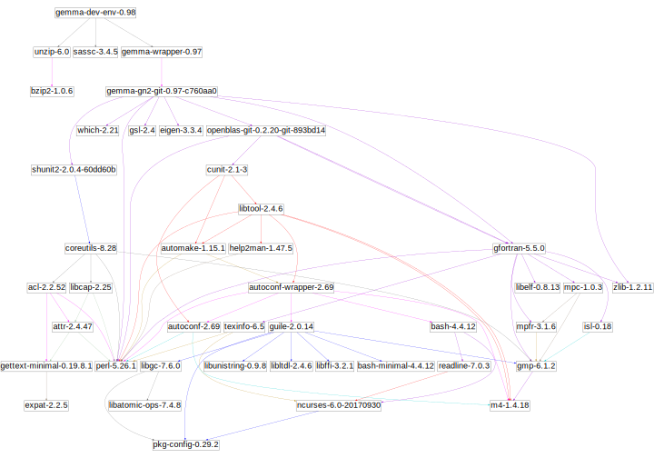

# INSTALL GEMMA: Genome-wide Efficient Mixed Model Association

     

## Check version

Simply run gemma once installed

    gemma

and it should give you the version.

## GEMMA dependencies

GEMMA runs on Linux and MAC OSX and the runtime has the following
dependencies:

* C++ tool chain >= 4.9
* GNU Science library (GSL) 2.x is recommended
* blas/openblas
* lapack
* [Eigen3 library](http://eigen.tuxfamily.org/dox/)
* zlib

See below for installation on Guix.

## Install GEMMA

### Debian and Ubuntu

Travis-CI uses Ubuntu for testing. Check the test logs for version numbers.

Current settings can be found in [travis.yml](.travis.yml).

### Bioconda

Recent versions of GEMMA can be installed with
[BioConda](http://ddocent.com/bioconda/) without root permissions using the following
command

    conda install gemma

### Brew

### GNU Guix

The GNU Guix package manager can install recent versions of [GEMMA](https://www.gnu.org/software/guix/packages/g.html)
using the following command

    guix package -i gemma

To build GEMMA from source you can opt to install the build tools with GNU Guix

    guix package -i make gcc linux-libre-headers gsl eigen openblas lapack glibc ld-wrapper

Even better you can create a container in the source tree and run our development setup

    guix environment -C guix --ad-hoc gcc gdb gfortran:lib gsl eigen openblas zlib bash ld-wrapper perl
    make clean
    make GUIX=$GUIX_ENVIRONMENT check -j 4

and for the Clang edition

    guix environment -C guix --ad-hoc clang gcc gdb gfortran:lib gsl eigen openblas zlib bash ld-wrapper perl
    make clean
    make GUIX=$GUIX_ENVIRONMENT CXX=clang++ check -j 4

To test with another dependency, e.g. GSLv1

    env GUIX_PACKAGE_PATH=../guix-bioinformatics/ guix environment -C guix --ad-hoc gcc gdb gfortran:lib gsl1 eigen openblas zlib bash ld-wrapper perl

or replace openblas with atlas

    env GUIX_PACKAGE_PATH=~/izip/git/opensource/genenetwork/guix-bioinformatics/ ~/.config/guix/current/bin/guix environment -C guix --ad-hoc gcc gdb gfortran:lib gsl1 eigen lapack atlas zlib bash ld-wrapper perl
    make clean && make WITH_OPENBLAS= WITH_ATLAS=1

#### GNU Guix reproducible build system

One of the challenges of developing software is dealing with
dependencies. GNU Guix provides a way of using reproducible build
systems. This is done by providing the exact same build 'graph'. This
has the advantage that we easily can go back in time when users report
issues (i.e., for the purpose of debugging).

Note that this is an advanced configuration option at this stage. GNU
Guix will make it easier in the future to deal with shared
graphs. Contact Pjotr Prins if you are really interested. For development
we have the [gemma-dev-env package](https://gitlab.com/genenetwork/guix-bioinformatics/blob/master/gn/packages/gemma.scm).

The following two links capture and provide the current reproducible build
system that we use for development of GEMMA to generate /gnu/store/9ahrb1swr06kjm2gr2zg0fsyvps3xqgz-profile

1. https://gitlab.com/genenetwork/guix-bioinformatics/tree/99718d253ec9ed8ed836f0a348381a7cd83d4b9f
2. https://gitlab.com/genenetwork/guix/tree/686f5b9a8cdb66e81140b03a42644579e7eb1f9a

Check the tree out, build Guix from source and run something like

    env GUIX_PACKAGE_PATH=../guix-bioinformatics/ ./pre-inst-env guix package -i gemma-dev-env  --no-grafts --substitute-urls="https://berlin.guixsd.org http://guix.genenetwork.org https://mirror.hydra.gnu.org" -p ~/opt/gemma-dev-env

Now by setting the environment you should be set to compile everything, see ~/opt/gemma-dev-env/etc/profile

    export LIBRARY_PATH=~/opt/gemma-dev-env/lib
    export C_INCLUDE_PATH=~/opt/gemma-dev-env/include
    export CPLUS_INCLUDE_PATH=~/opt/gemma-dev-env/include
    export CPATH=~/opt/gemma-dev-env/include
    export PATH=~/opt/gemma-dev-env/bin:/usr/bin:/bin

and build by setting GUIX to profile

    make clean
    make GUIX=~/opt/gemma-dev-env
    make GUIX=~/opt/gemma-dev-env check

The following generates the graph for the full current *build* system of GEMMA

    env GUIX_PACKAGE_PATH=../guix-bioinformatics/ ./pre-inst-env guix graph gemma-dev-env  |dot -Gsize="10,10" -Gratio=0.7 -Tsvg -Nfontsize=48 > dag.svg

To zoom in download the SVG file and display it in your browser.

Another way to view the runtime graph is to use

    ldd gemma

        libgsl.so.23 => /home/wrk/opt/gemma-dev-env/lib/libgsl.so.23 (0x00007efec0826000)
        libopenblas.so.0 => /home/wrk/opt/gemma-dev-env/lib/libopenblas.so.0 (0x00007efebe288000)
        libz.so.1 => /home/wrk/opt/gemma-dev-env/lib/libz.so.1 (0x00007efebe06d000)
        libgfortran.so.3 => /home/wrk/opt/gemma-dev-env/lib/libgfortran.so.3 (0x00007efebdd4c000)
        libquadmath.so.0 => /home/wrk/opt/gemma-dev-env/lib/libquadmath.so.0 (0x00007efebdb0b000)
        libstdc++.so.6 => /home/wrk/opt/gemma-dev-env/lib/libstdc++.so.6 (0x00007efebd790000)
        libm.so.6 => /home/wrk/opt/gemma-dev-env/lib/libm.so.6 (0x00007efebd444000)
        libgcc_s.so.1 => /home/wrk/opt/gemma-dev-env/lib/libgcc_s.so.1 (0x00007efebd22d000)
        libpthread.so.0 => /home/wrk/opt/gemma-dev-env/lib/libpthread.so.0 (0x00007efebd00f000)
        libc.so.6 => /home/wrk/opt/gemma-dev-env/lib/libc.so.6 (0x00007efebcc5d000)
        /gnu/store/n6acaivs0jwiwpidjr551dhdni5kgpcr-glibc-2.26.105-g0890d5379c/lib/ld-linux-x86-64.so.2

and follow the paths.

### Install from source

Install listed dependencies and run

	make -j 4

(the -j switch builds on 4 cores).

if you get an Eigen error you may need to override the include
path. E.g. to build GEMMA on GNU Guix with shared libs the following
may work

    make EIGEN_INCLUDE_PATH=~/.guix-profile/include/eigen3

another example overriding optimization and LIB flags (so as to link
against gslv1) would be

    make EIGEN_INCLUDE_PATH=~/.guix-profile/include/eigen3 GCC_FLAGS="-Wall -isystem/$HOME/opt/gsl1/include" LIBS="$HOME/opt/gsl1/lib/libgsl.a $HOME/opt/gsl1/lib/libgslcblas.a -L$HOME/.guix-profile/lib -pthread -llapack -lblas -lz"

to run GEMMA tests

	time make check

You can run gemma in the debugger with, for example

	gdb --args \
		./bin/gemma -g example/mouse_hs1940.geno.txt.gz \
		-p example/mouse_hs1940.pheno.txt -a example/mouse_hs1940.anno.txt \
		-snps example/snps.txt -nind 400 -loco 1 -gk -debug -o myoutput

Note that if you get <optimized out> warnings on inspecting variables you
should compile with GCC_FLAGS="" to disable optimizations (-O3). E.g.

    make EIGEN_INCLUDE_PATH=~/.guix-profile/include/eigen3 GCC_FLAGS=

If you get older OpenBlas errors you may need to add
OPENBLAS_LEGACY=1.

Other options, such as compiling with warnings, are listed in the
Makefile.

## Run tests

GEMMA includes the shunit2 test framework (version 2.0).

    make check

or

    ./run_tests.sh

## Optimizing performance

### Profiling

The gcc version has profiling support, run with

    make PROFILING=1

### OpenBlas

Linking against a built-from-source OpenBlas is a first optimization
step because it will optimize code for the local architecture (on my
workstation it easily doubles speed). When you check the output .log
file of GEMMA after a run, it will tell you how the linked-in OpenBlas
was compiled.

It is worth checking that you use OpenBlas's lapack and cblas
interfaces instead of linking against default lapack and gslcblas
libs.

To link a new version, compile OpenBlas as per
[instructions](http://www.openblas.net/).  You can start with the
default:

    make

and/or play with the switches (listed in OpenBlas Makefile.rule)

    make BINARY=64 NO_WARMUP=0 GEMM_MULTITHREAD_THRESHOLD=4 USE_THREAD=1 NO_AFFINITY=0 NO_LAPACK=1 NUM_THREADS=64 NO_SHARED=1

and you should see something like

    OpenBLAS build complete. (BLAS CBLAS LAPACK LAPACKE)

    OS               ... Linux
    Architecture     ... x86_64
    BINARY           ... 64bit
    C compiler       ... GCC  (command line : gcc)
    Fortran compiler ... GFORTRAN  (command line : gfortran)
    Library Name     ... libopenblas_haswellp-r0.3.0.dev.a (Multi threaded; Max num-threads is 64)

Note that OpenBlas by default uses a 32-bit integer API which can
overflow with large matrix sizes. We don't include LAPACK - the
OpenBlas version gives problems around eigenvalues for some reason.

We now have a static library which you can link using the full path
with using the GEMMA Makefile:

    time env OPENBLAS_NUM_THREADS=4 make EIGEN_INCLUDE_PATH=~/.guix-profile/include/eigen3 LIBS="~/tmp/OpenBLAS/libopenblas_haswellp-r0.3.0.dev.a -lgsl -pthread -lz" -j 4 unittests

Latest (INT64, no gslcblas):

    time env OPENBLAS_NUM_THREADS=4 make EIGEN_INCLUDE_PATH=~/.guix-profile/include/eigen3 LIBS="~/opt/gsl2/lib/libgsl.a ~/tmp/OpenBLAS/libopenblas_haswellp-r0.3.0.dev.a -pthread -lz  -llapack" OPENBLAS_INCLUDE_PATH=~/tmp/OpenBLAS/ -j 4 fast-check

### OpenBlas 64-bit API

<i>Warning: This is work in progress (WIP)</i>

OpenBlas supports a 64-bit API which allows for large matrices. Unfortunately
GEMMA does not support it yet, see https://github.com/genetics-statistics/GEMMA/issues/120

For testing we can build

    make BINARY=64 INTERFACE64=1 NO_WARMUP=1 USE_THREAD=0 NO_LAPACK=0 NO_SHARED=1 -j 4

This builds a 64-bit binary and API and no external LAPACK. This is a very conservative
setting for testing the 64-bit API.

Note, for performance we want a 64-bit binary with threading.

    make EIGEN_INCLUDE_PATH=~/.guix-profile/include/eigen3 LIBS="~/opt/gsl2/lib/libgsl.a ~/tmp/OpenBLAS/libopenblas_haswell-r0.3.0.dev.a ~/.guix-profile/lib/libgfortran.a ~/.guix-profile/lib/libquadmath.a -pthread -lz" OPENBLAS_INCLUDE_PATH=~/tmp/OpenBLAS/ -j 4 fast-check

Note we don't include standard lapack, because it is 32-bits.

## Trouble shooting

### undefined reference to `dpotrf_'

If you get errors like

    gemma/src/lapack.cpp:58: undefined reference to `dpotrf_'
    gemma/src/lapack.cpp:80: undefined reference to `dpotrs_'
    gemma/src/lapack.cpp:162: undefined reference to `dsyev_'

it means you need to link against LAPACK. E.g.

    make WITH_LAPACK=1
